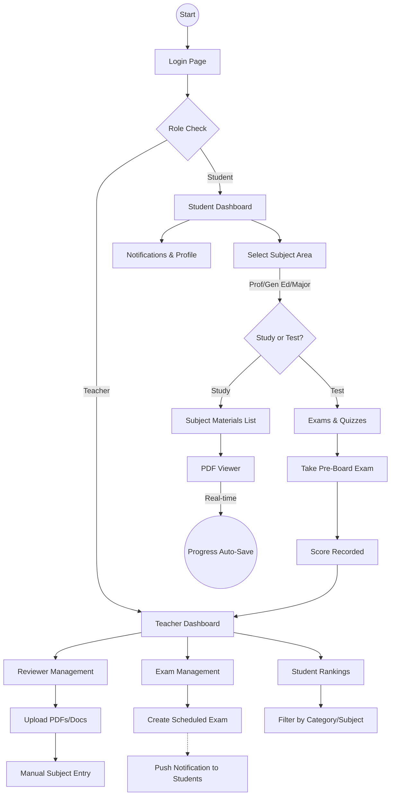

# BTVTED System (Beta)

> [!IMPORTANT]
> This system is currently **UNDER PRODUCTION**. Core features for Reviewer Management, Reading Progress, and Scheduled Exams are implemented. The next phase focuses on enhancing Exam Logic, system-wide responsiveness, and robust error handling.

## 🎓 Overview
The **BTVTED System** is a comprehensive review and examination portal designed specifically for BTVTED students preparing for their board/non-board examinations. It provides a structured environment for teachers to manage materials, schedule custom exams, and for students to track their preparation progress across multiple subject areas.

## 🛠️ Tech Stack
- **Frontend**: Vanilla HTML5, CSS3 (Modern Flexbox/Grid), Vanilla JavaScript (ES6+).
- **Backend**: Native PHP (7.4+).
- **Database**: MySQL.
- **Libraries**:
  - `PDF.js`: For high-fidelity browser-based PDF rendering.
  - `SweetAlert2`: For polished, interactive user notifications.

## 🌟 Newly Added Features

- **Separation of Reviewer & Quiz**: Documents and study materials (Reviewers) are now distinctly separated from tests and assessments (Quizzes/Exams). This provides a cleaner UI flow for students to either study or test themselves.
- **Custom Scheduled Exams**: Teachers can now explicitly create custom exams, assign them to a subject category (General Education, Major, Professional Education), specific subject matter, and schedule an exact Date and Time for the exam. 
- **Real-time Notifications**: When a teacher schedules a new exam, a notification is automatically generated and pushed to all enrolled students so they are aware of the upcoming test.

## 🔄 System Flowchart

## 🚀 How it Works

### 👨‍🏫 For Teachers
1.  **Reviewer Management**: Upload study materials (PDF, DOCX, etc.) Categorized into General Ed, Major, or Prof Ed.
2.  **Subject Management**: Create new specific subjects on the fly during upload if they don't exist.
3.  **Scheduled Exams**: Create manual or auto-generated exams and set a precise schedule for when students should take them.
4.  **Student Monitoring**: View real-time rankings and scores of students based on their performance in practice exams.

### 👨‍🎓 For Students
1.  **Structured Learning**: Browse materials organized by major board exam categories.
2.  **Smart Reading Progress**: The system tracks exactly how much of a document you've read. If you close a file at 62%, it stays at 62% and saves your exact scroll position for when you return.
3.  **Dedicated Exam Portal**: Navigate seamlessly to the "Exams & Quizzes" section to see all available tests, highlighted with special badges if they are scheduled by the teacher.
4.  **Profile & Notifications**: Track your latest scores and instantly receive alerts when a new exam is scheduled.

---

## 📅 Roadmap (Next Phases)
- [ ] **Advanced Exam Logic**: More specialized question types and duration controls.
- [ ] **Full Responsiveness**: Mobile-first UI optimization for studying on the go.
- [ ] **Global Error Handling**: Centralized logging and user-friendly error recovery.
- [ ] **Performance Audit**: Optimizing large file loads and database queries.

abxd